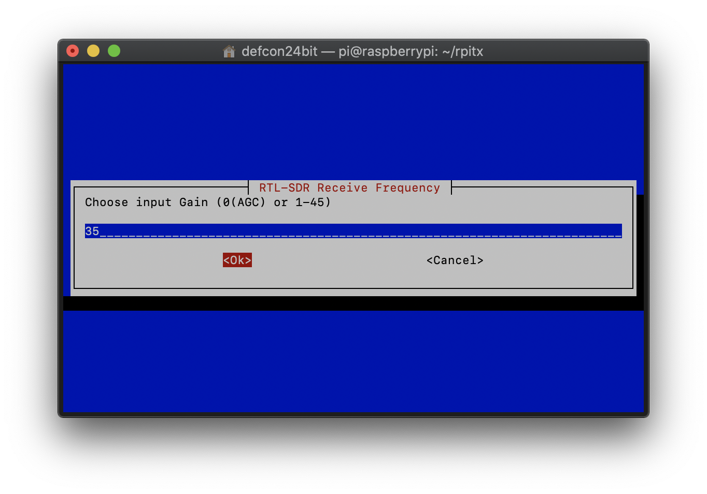
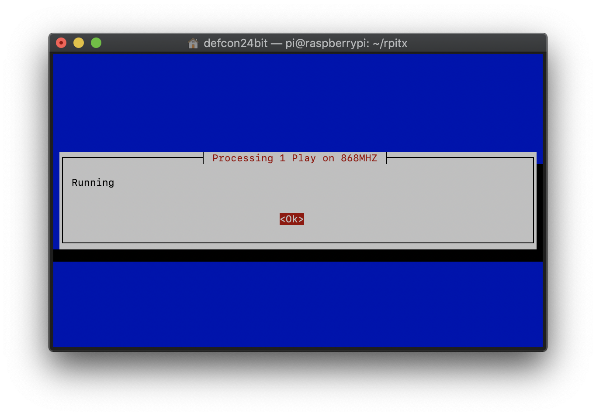

# record and replay Radio Frequency (RF) remote signal 
Record any RF signal and trigger replay with voice commands.     
<!--Use voice commands to control devices that use a Radio Frequency (RF) remote.   
Examples with picture: airconditioner, remote power plugs, fans and kichen hoods. 
Text-->

## required hardware

* Raspberry Pi 
* radio receiver USB dongle (RTL-SDR with RTL2832U shipset)

## record RF signal 

1. Install [Raspberry Pi OS](https://www.raspberrypi.org/downloads/raspberry-pi-os/) on your Pi (previously called Raspbian). 
2. Connect RTL-SDR dongle to your Pi. 
3. Install https://github.com/F5OEO/rpitx
4. Launch the rpitx menu.
```bash
cd rpitx
./rtlmenu.sh
```






## create webhook

You'll need internet-facing webhooks to receive the voice triggers.  
I'll use [Home Assistant](https://www.home-assistant.io) (hassio) for that.  

#### create certificate on hassio

> Only required if hassio runs on a different machine than rpitx.
A certificate allows hassio to remote execute a commands on your PI without a password prompt. 
  
create certificate
```bash
ssh-keygen -t rsa -b 4096
```
send certificate to your pi (command still run on hassio)
```bash
ssh-copy-id pi@192.168.1.203
```

#### create command_line switch to configuration.yaml

```yaml
switch:
  - platform: command_line
    switches:
      fan_on:
        command_on: "ssh -i /config/id_rsa -o StrictHostKeyChecking=no -q pi@192.168.1.203 sudo ./rpitx/sendiq -s 250000 -f 868.0000e6 -t u8 -i ./rpitx/fan-all-on.iq | wc -l >> /config/command.log"
        command_off: off
        command_state: off
        friendly_name: Fan On
```

#### create an automation that exposes a webhook 

```yaml
automation:
  - alias: webhook_fan_on
    trigger:
    - platform: webhook
      webhook_id: <pick-a-random-webhook-id>
    condition: []
    action:
    - data: {}
      entity_id: switch.fan_on
      service: switch.turn_on
    mode: single
```
