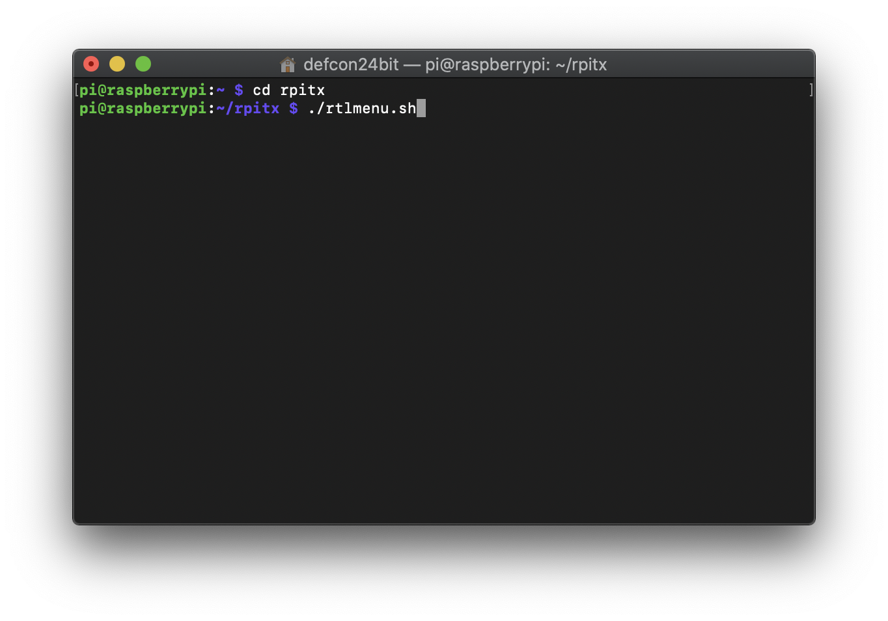
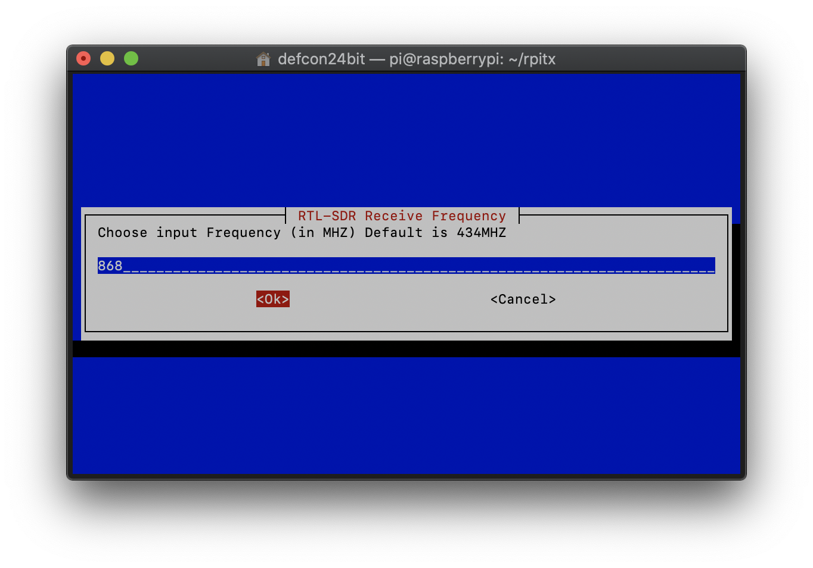
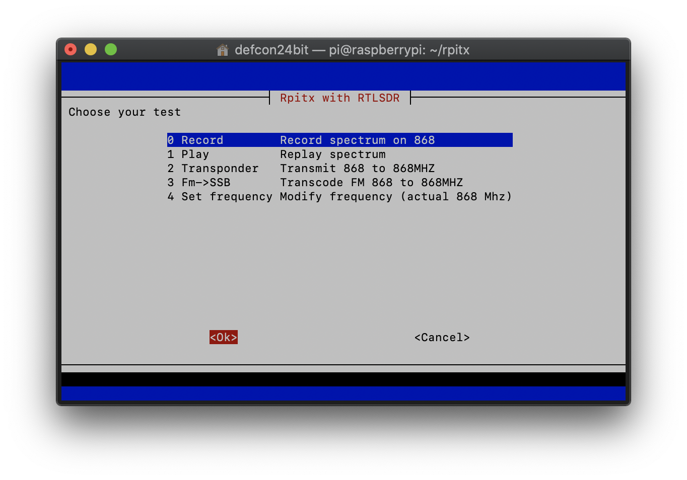
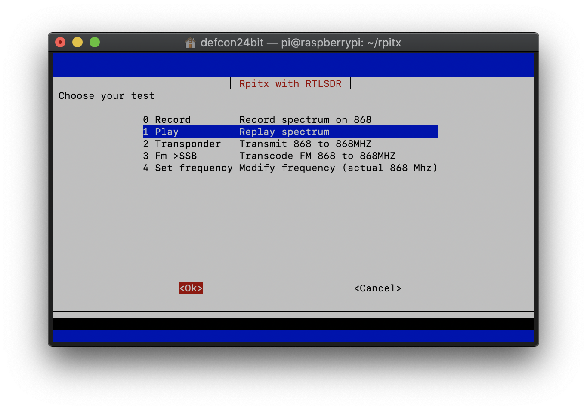

# Record and replay Radio Frequency (RF) remote signal.   
Using a Raspberry PI, record any RF remote signal.  Replay it with voice commands through Alexa, Google Home or Siri.  Includes example how to integrate with Home Assistant and IFTTT. 
<!--Use voice commands to control devices that use a Radio Frequency (RF) remote.   
Examples with picture: airconditioner, remote power plugs, fans and kichen hoods. 
Text-->

## required hardware

* Raspberry PI 
* radio receiver USB dongle (RTL-SDR with RTL2832U shipset)

## record RF signal 

install https://github.com/F5OEO/rpitx on your Raspberry PI

```bash
cd rpitx
./rtlmenu.sh
```









## integrate with Home Assistant

> Home Assistant (hassio) isn't required.  You only need an **internet-exposed webhook** to receive the voice triggers.  I use hassio for that.

#### create certificate on hassio and install it on your PI  

> Only required if hassio runs on a different machine than rpitx.  The certificates will allow hassio to remote execute a command (ssh) on the PI without a password prompt.     

create certficate on hassio
```bash
ssh-keygen -t rsa -b 4096
```
send certifcate to your pi (command still run on hassio)
```
ssh-copy-id pi@192.168.1.203
```

#### create command_line switch to configuration.yaml

```yaml
switch:
  - platform: command_line
    switches:
      fan_on:
        command_on: "ssh -i /config/id_rsa -o StrictHostKeyChecking=no -q pi@192.168.1.203 sudo ./rpitx/sendiq -s 250000 -f 868.0000e6 -t u8 -i ./rpitx/fan-all-on.iq | wc -l >> /config/command.log"
        command_off: off
        command_state: off
        friendly_name: Fan On
```

#### create an automation that exposes a webhook 

```yaml
automation:
  - alias: webhook_fan_on
    trigger:
    - platform: webhook
      webhook_id: <pick-a-random-webhook-id>
    condition: []
    action:
    - data: {}
      entity_id: switch.fan_on
      service: switch.turn_on
    mode: single
```
